# GANJJ Front

Frontend do e-commerce **GANJJ** — loja de roupas com vitrine pública, carrinho de compras, checkout, acompanhamento de pedidos e painel administrativo.

Construído com **React 18 + TypeScript + Vite + Tailwind CSS**.

---

## Tecnologias

- **React 18** com TypeScript
- **Vite** como bundler e servidor de desenvolvimento
- **Tailwind CSS v4** para estilização
- **MUI (Material UI)** e **Radix UI** para componentes
- **React Router v7** para navegação
- **Recharts** para gráficos no dashboard
- **React DnD** para drag-and-drop
- **Vitest** para testes automatizados

---

## Pré-requisitos

- [Node.js](https://nodejs.org/) v18 ou superior
- A [ganjj-api](../ganjj-api/README.md) rodando (API Gateway na porta `3000`)

---

## Instalação

```bash
npm install
```

---

## Executando o projeto

```bash
# Servidor de desenvolvimento com hot-reload
npm run dev
```

A aplicação estará disponível em `http://localhost:5173`.

### Outros comandos

```bash
# Build de produção
npm run build

# Executar testes
npm test

# Executar testes em modo watch
npm run test:watch
```

---

## Páginas e rotas

### Área pública

| Rota | Página | Descrição |
|---|---|---|
| `/` | Landing Page | Página inicial com destaques |
| `/listing` | Listagem | Catálogo completo de produtos |
| `/product/:id` | Produto | Detalhes de um produto |
| `/sale` | Sale | Produtos em promoção |
| `/lookbook` | Lookbook | Galeria de looks |
| `/search` | Busca | Resultados de pesquisa |
| `/about` | Sobre | Sobre a marca |
| `/stores` | Lojas | Lojas físicas |
| `/returns` | Trocas | Política de trocas e devoluções |
| `/contact` | Contato | Formulário de contato |

### Autenticação

| Rota | Página |
|---|---|
| `/login` | Login |
| `/register` | Criar conta |
| `/forgot-password` | Recuperação de senha |

### Área do cliente (requer login)

| Rota | Página | Descrição |
|---|---|---|
| `/checkout` | Checkout | Finalização de compra |
| `/my-orders` | Meus pedidos | Histórico e rastreamento de pedidos |
| `/settings` | Configurações | Dados da conta |

### Área administrativa (requer login + admin)

| Rota | Página | Descrição |
|---|---|---|
| `/admin/dashboard` | Dashboard | Métricas e gráficos gerais |
| `/admin/products` | Produtos | Gerenciar catálogo (CRUD + upload de imagem) |
| `/admin/orders` | Pedidos | Gerenciar e avançar etapas dos pedidos |
| `/admin/users` | Usuários | Gerenciar usuários cadastrados |

---

## Autenticação

A autenticação usa **JWT via cookie HTTP-only** — o token é definido automaticamente pelo backend no login e enviado em cada requisição. Não é necessário armazenar token manualmente.

Contextos disponíveis:
- `AuthContext` — estado do usuário autenticado
- `CartContext` — estado da cesta de compras

---

## Estrutura do projeto

```
ganjj-front/
├── src/
│   ├── app/
│   │   ├── components/      # Header, Footer, sidebars, componentes reutilizáveis
│   │   ├── hooks/           # Hooks customizados (ex: usePageTitle)
│   │   ├── pages/           # Uma pasta/arquivo por página
│   │   └── routes.ts        # Definição de todas as rotas
│   ├── contexts/
│   │   ├── AuthContext.tsx  # Estado global de autenticação
│   │   └── CartContext.tsx  # Estado global do carrinho
│   ├── lib/
│   │   └── api.ts           # Todas as chamadas à API (authApi, produtoApi, cestaApi, pedidoApi...)
│   ├── assets/              # Imagens estáticas
│   └── styles/              # CSS global, temas e fontes
├── public/                  # Assets públicos
├── index.html
└── vite.config.ts
```

---

## Conexão com a API

Todas as chamadas à API estão centralizadas em [`src/lib/api.ts`](src/lib/api.ts) e apontam para `http://localhost:3000` (API Gateway).

Consulte o [README da API](../ganjj-api/README.md) para instruções de configuração do backend e documentação de endpoints.

A documentação interativa da API (Scalar) está publicada online em **https://jcliz.github.io/ganjj-api/** e também fica disponível em **`http://localhost:3000/api/docs`** enquanto o backend estiver rodando.

---

## Gitflow

Estratégia de branches utilizada no repositório do frontend:

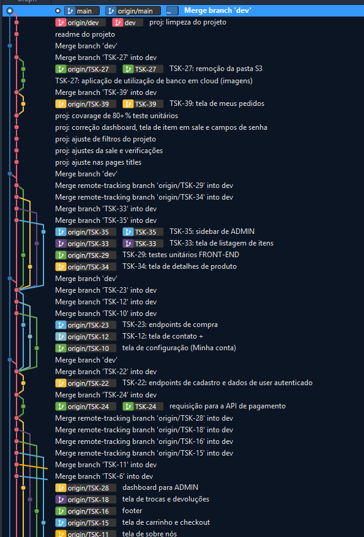

---

## Sprints

Acompanhamento das sprints do projeto (boards do Kanban).

### Sprint 1

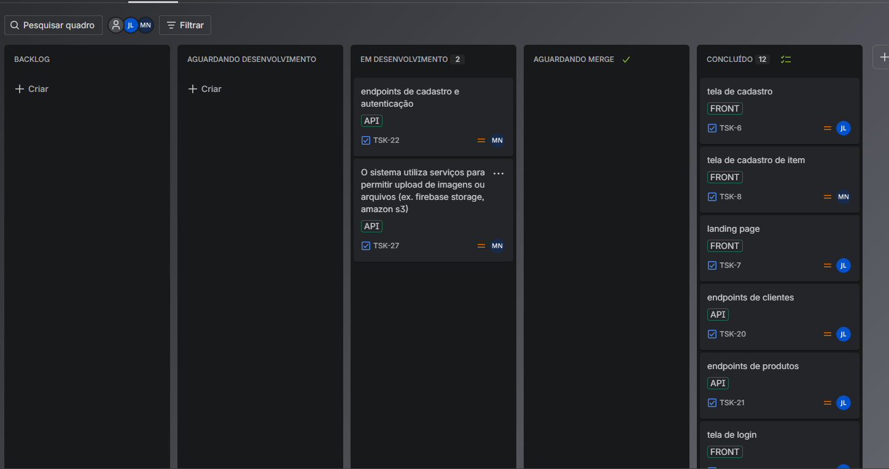
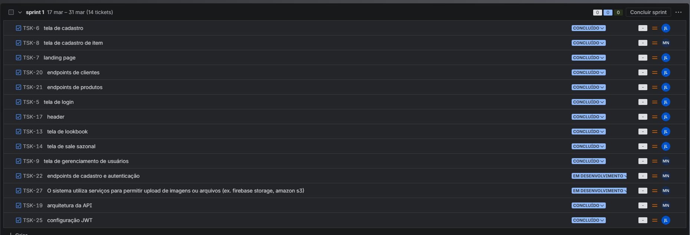
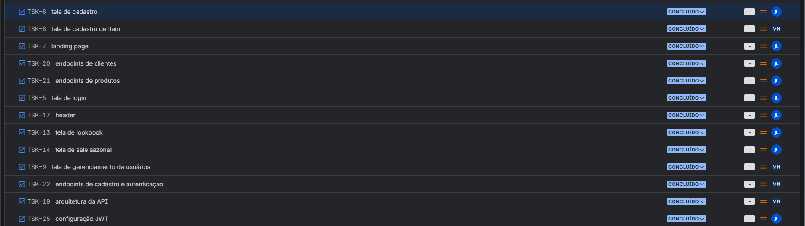

### Sprint 2

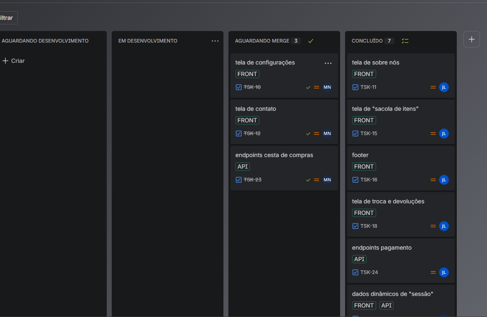
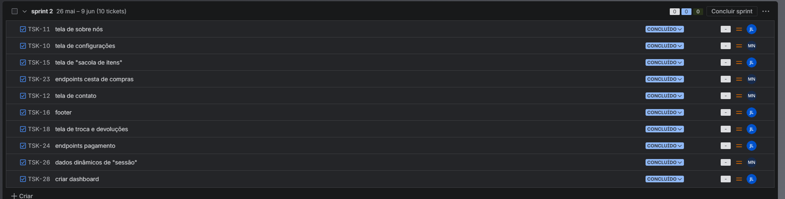

### Sprint 3

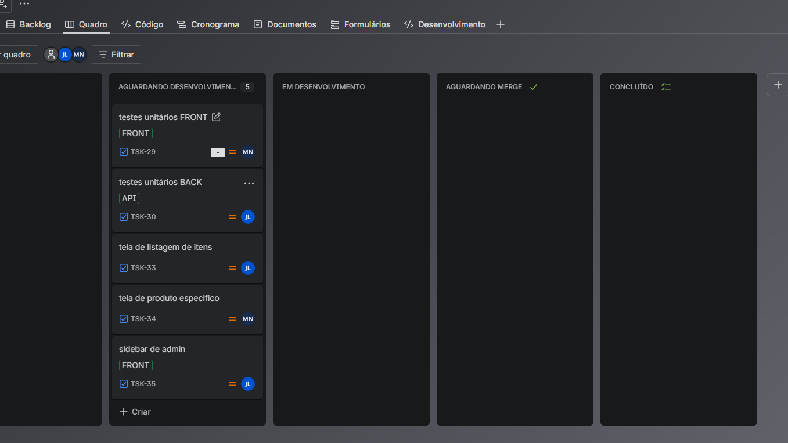
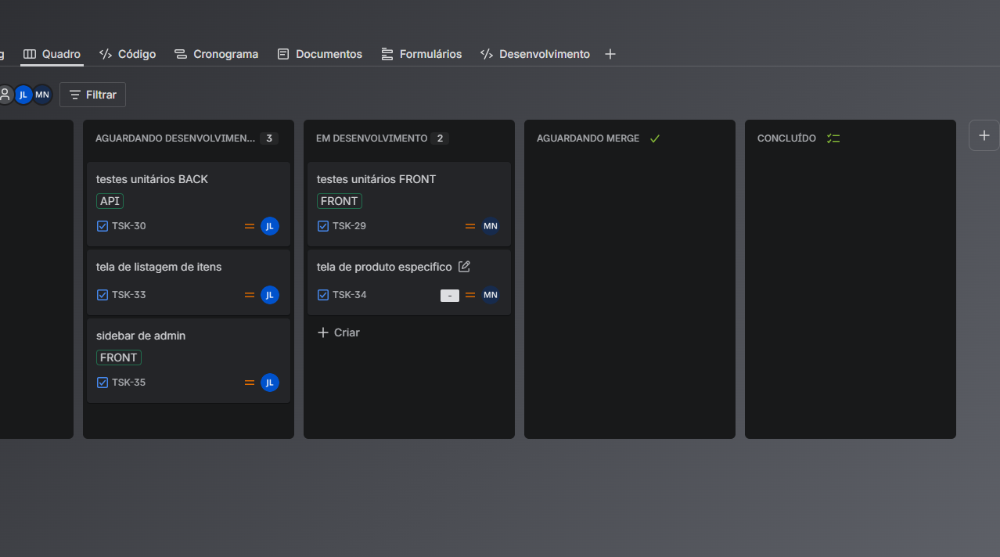
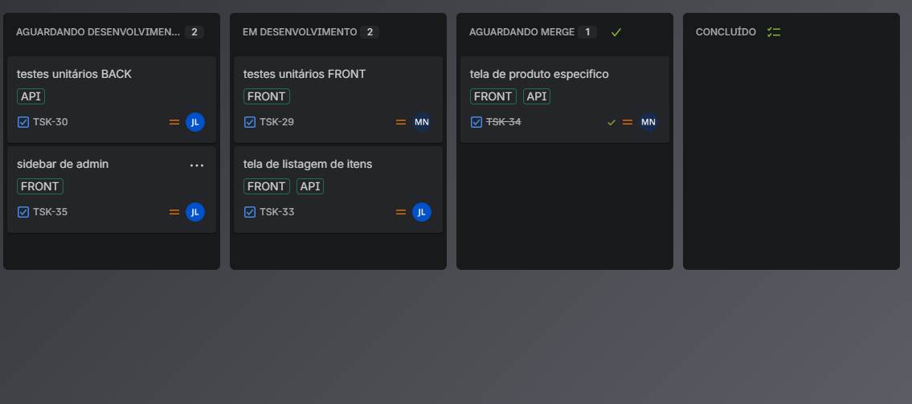

### Sprint 4

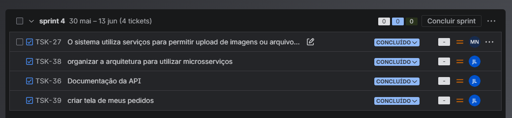

### Sprint 5

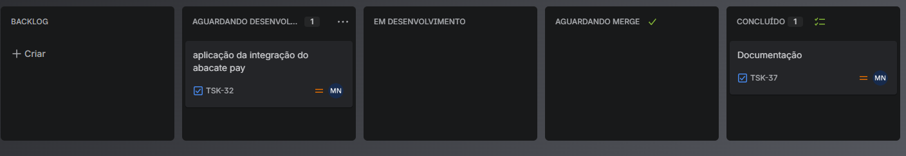
